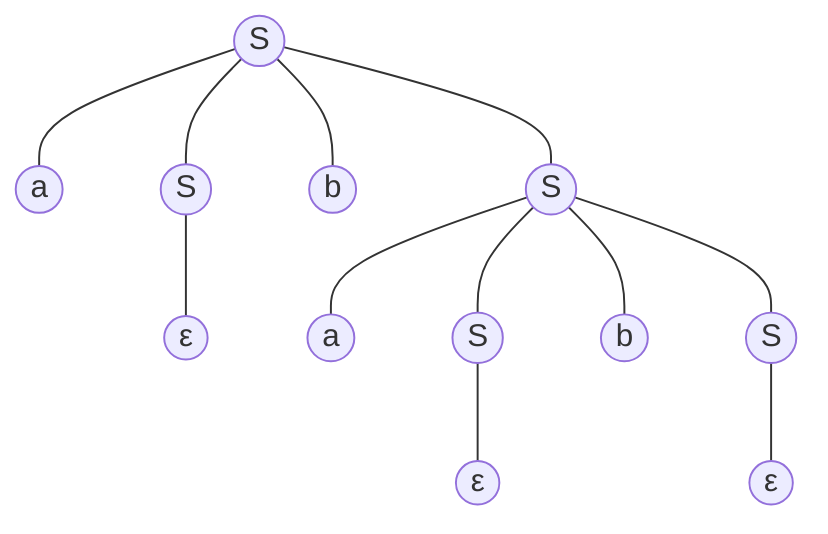

<b>编译原理H HW3-1</b>

肖桐 PB18000037

# 3.2.

(a). 句子abab的两个最左推导：

$S \to aSbS \to abS \to abaSbS \to ababS \to abab$

$S \to aSbS \to abSaSbS \to abaSbS \to ababS \to abab$

因此该文法是二义的。

(b). 句子abab的最右推导：

$S \to aSbS \to aSbaSbS \to aSbaSb \to aSbab \to abab$

(c). 语法分析树：

最右推导分析树：

(d). 该文法产生的语言是a、b个数相同的串的集合。证明如下：

先证该文法表达的所有串都是a、b个数相同的：由$S$的生成式显然知串长$l$为偶数。

对串的长度作归纳。当$l = 0$时有$S \to \varepsilon$，此时显然a、b个数相同，都为0.

记$S_{l}$为长度为$l$的串。假设当$l \leq 2n\ (n \geq 0)$时$S_{l}$为a、b个数相同的串，则当$l = 2n + 2$时，$S_{2n+2} \to aS_ibS_j | bS_mbS_n$.

对于$S_{2n + 2} \to aS_ibS_j$：由于$i, j \leq 2n$，故$S_i, S_j$都是a、b个数相等的串，故$S_{2n + 2}$中，a的个数为$\dfrac{i}{2} + \dfrac{j}{2} + 1 = n + 1$，b的个数也为$\dfrac{i}{2} + \dfrac{j}{2} + 1 = n + 1$. 即$S_{2n + 2}$也是a、b个数相等的串。

对于$S_{2n + 2} = bS_maS_n$同理。

故该文法表达的所有串都是a、b个数相同的。

再证所有a、b个数相等的串都能被该文法表达。假设有长度为$l$的、a, b个数相同的任意串$T_l$.

同样也对串的长度作归纳。当$l = 0$时$T_0 = \varepsilon$，能够由$S \to \varepsilon$产生，即此时有$S \to T_0$。

假设当$l \leq 2n$时有$S \to T_l$，则当$l = 2n + 2$时，$T_{2n + 2}$可分为两种情况：

1. 以字符a开头
2. 以字符b开头

对于第一种情况：令$a\beta b$为$T_{2n + 2}$的最短的、a, b个数相等的非空前缀。那么$T_{2n + 2}$可表示为：$T_{2n + 2} = a\beta b\gamma$. 由于$\beta, \gamma$的长度均不大于$2n$，故$S \to \beta, S \to \gamma$，继而由产生式$S \to aSbS$知$S \to T_{2n + 2}$. 

当$T_{2n + 2}$以字符b开头由$S \to bSaS$同理可以导出$S \to T_{2n + 2}$.

因此综上，该文法产生的语言是a、b个数相同的串的集合。

# 3.6.

(a). 正则表达式：b\*(ab+)\*

上下文无关文法：

$S \to LR$

$R \to abLR | \varepsilon$

$L \to bL | \varepsilon$

(b). 上下文无关文法：

$S \to aT | bT$

$T \to aTbT | bTaT | \varepsilon$

# 3.8.

记'('为m，')'为n，','为c。则该文法为：

$S \to mLn | a$

$L \to LcS | S$

将$S$带入到$L$中有：$L \to LcmLn | Lca | mLn | a$

再记$\beta_1 = cmLn, \beta_2 = ca, \gamma_1 = mLn, \gamma_2 = a$，则$L$变为：

$L \to L\beta_1 | L\beta_2 | \gamma_1 | \gamma_2$

可将$L$改写为：

$L = \gamma_1L' | \gamma_2L'$

$L' = \beta_1L' | \beta_2L'$

故最终消除左递归后的文法为：

$S \to (L) | a$

$L \to aL' | (L)L'$

$L' \to ,(L)L' | ,a(L)L' | \varepsilon$

# 3.11.

$FIRST(A) = \{a, b\}, FIRST(B) = \{a, b\}, FIRST(S) = \{\varepsilon, a, b\}$. 

$FOLLOW(S) = \{\$\}$

由产生式易知$FIRST(aBB) = \{a\}, FIRST(bAA) = \{b\}$.

则由算法容易得到以下分析表：

| 非终结符 |      | 终结符 |      |
| :------: | :--: | :----: | :----: |
|          |  a   |   b    | \$ |
|    S     | $S \to aBS$ | $S \to bAS$ | $S \to \varepsilon$ |
|    A     | $A \to a$ | $A \to bAA$ |      |
|    B     | $B \to aBB$ | $B \to b$ |      |

# 3.12.

该文法不是LL(1)文法。

对于产生式：$S \to AB | PQx$

由$A \to xy$知：$x \in FIRST(AB)$，同时又由$P \to dP|\varepsilon$和$Q \to aQ|\varepsilon$知$x \in FIRST(PQx)$。

即$x \in FIRST(AB) \cap FIRST(PQx) \neq \O$

因此该文法不是LL(1)文法.