

<b>编译原理H HW3-2</b>

肖桐 PB18000037

# 3.16.

(a). (a,(a,a))的最右推导为：

$S \to (L)$，右句型为$(L)$，句柄为$(L)$

$(L) \to (L,S)$，右句型为$(L,S)$，句柄为$L,S$

$(L,S) \to (L,(L))$，右句型为$(L,(L))$，句柄为$(L)$

$(L,(L)) \to (L,(L,S))$，右句型为$(L,(L,S))$，句柄为$L,S$

$(L,(L,S)) \to (L,(L,a))$，右句型为$(L,(L,a))$，句柄为$a$

$(L,(L,a)) \to (L,(S,a))$，右句型为$(L,(S,a))$，句柄为$S$

$(L,(S,a)) \to (L,(a,a))$，右句型$(L,(a,a))$，句柄为$a$

$(L,(a,a)) \to (S,(a,a))$，右句型为$(S,(a,a))$，句柄为$S$

$(S,(a,a)) \to (a,(a,a))$，右句型为$(a,(a,a))$，句柄为$a$

(b).

|    栈    |    输入     |         动作         |
| :------: | :---------: | :------------------: |
|    \$    | (a,(a,a))\$ |         移入         |
|   \$(    | a,(a,a))\$  |         移入         |
|   \$(a   |  ,(a,a))$   |  按照$S \to a$约归   |
|   $(S    |  ,(a,a))$   |  按照$L \to S$约归   |
|   $(L    |  ,(a,a))$   |         移入         |
|   $(L,   |   (a,a))$   |         移入         |
|  $(L,(   |   a,a))$    |         移入         |
|  $(L,(a  |    ,a))$    |  按照$S \to a$约归   |
|  $(L,(S  |    ,a))$    |  按照$L \to S$约归   |
|  $(L,(L  |    ,a))$    |         移入         |
| $(L,(L,  |    a))$     |         移入         |
| $(L,(L,a |     ))$     |  按照$S \to a$约归   |
| $(L,(L,S |     ))$     | 按照$L \to L, S$约归 |
|  $(L,(L  |     ))$     |         移入         |
| $(L,(L)  |     )$      | 按照$S \to (L)$约归  |
|  $(L,S   |     )$      | 按照$L \to L,S$约归  |
|   $(L    |     )$      |         移入         |
|   $(L)   |      $      | 按照$S \to (L)$约归  |
|    $S    |      $      |         接受         |

(c). 因为'('似乎在图中不能显示，因此用lb(left bracket)代替左括号'('，用rb(right bracket)代替右括号')'

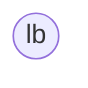

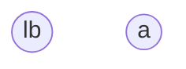

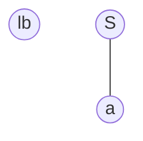

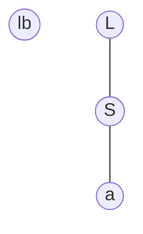

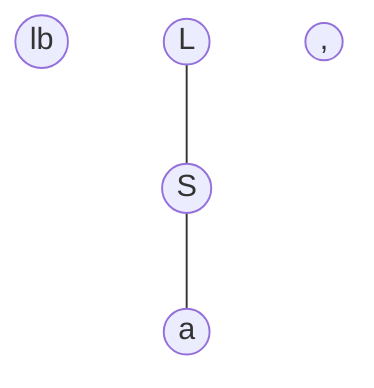

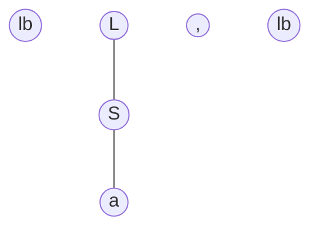

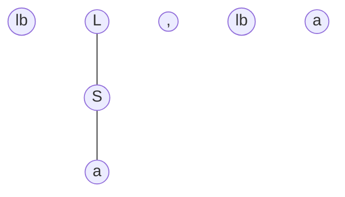

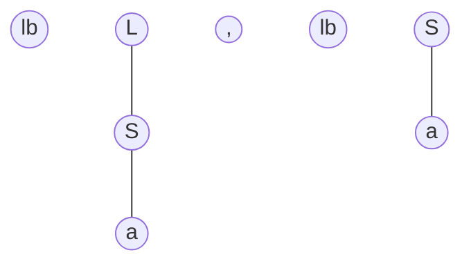

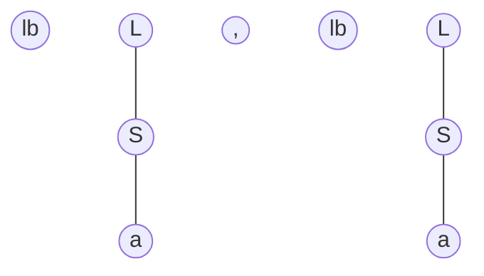

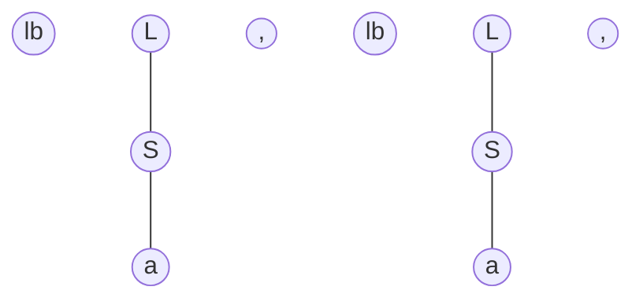

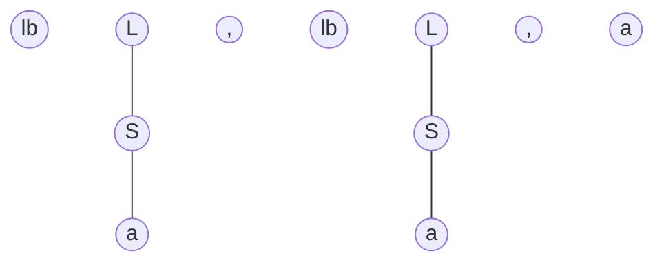

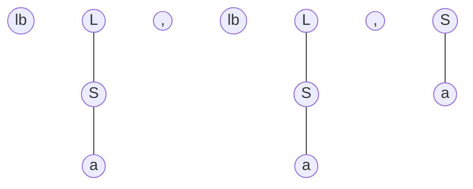

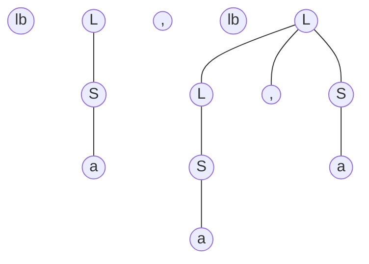

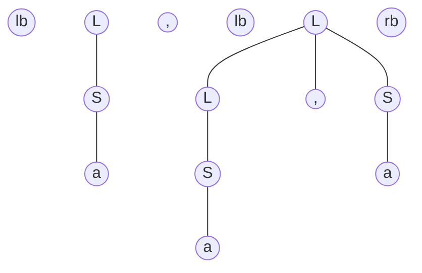

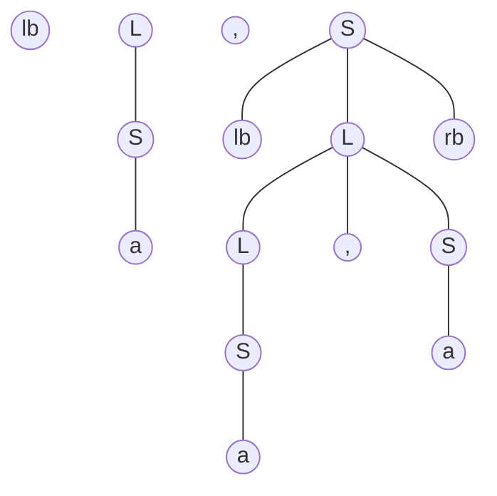

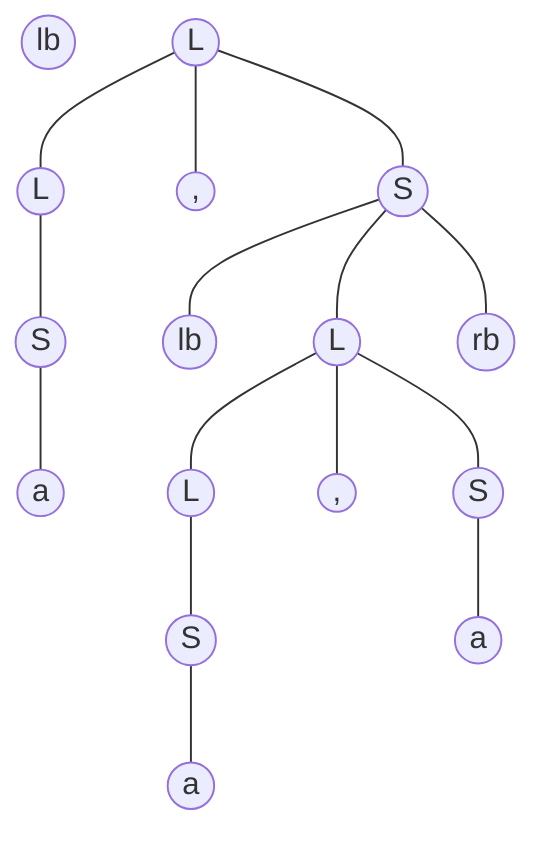

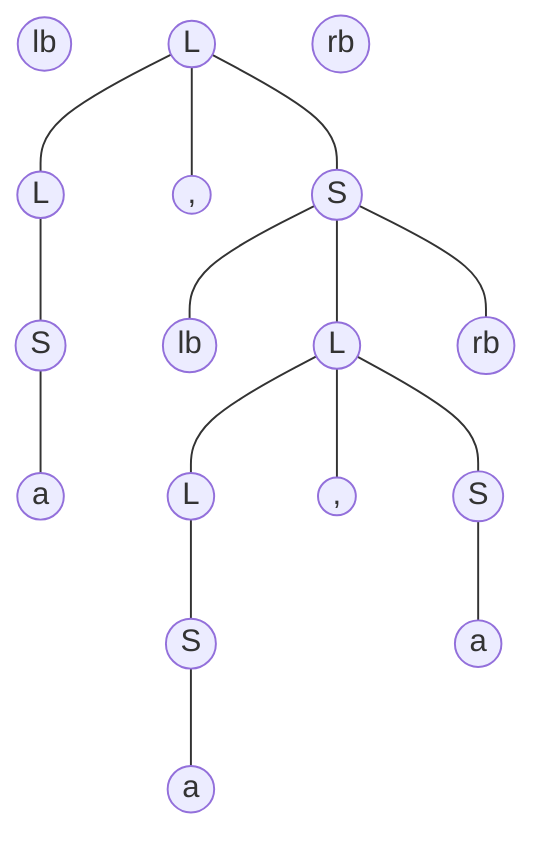

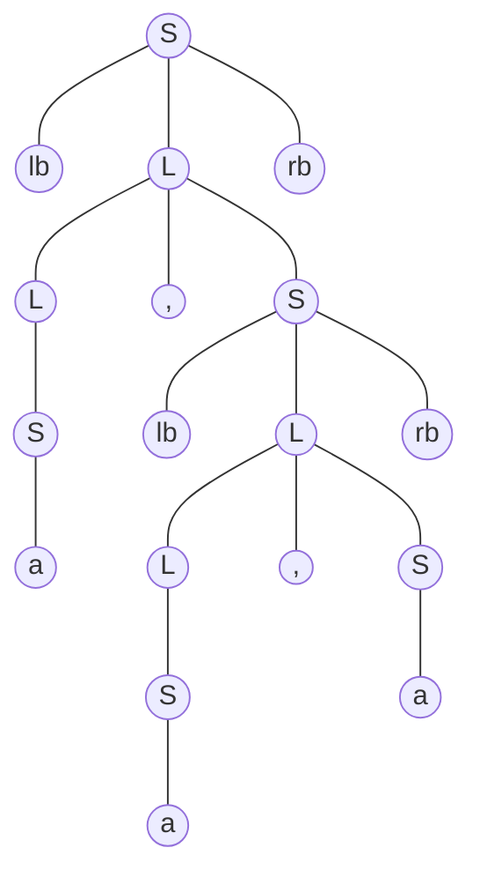

